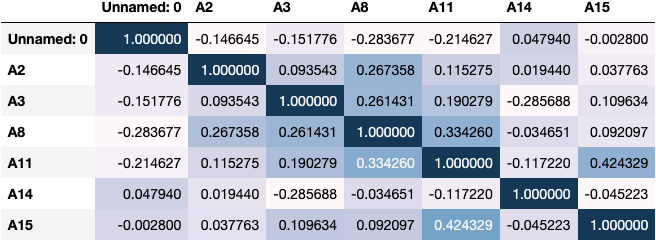

```{r setup, include=FALSE}
knitr::opts_chunk$set(echo = FALSE)
library(knitr)
library(kableExtra)
library(tidyverse)
```

```{r load model results, include = FALSE}
knitr::opts_chunk$set(echo = FALSE)
test_score_df <- read_csv("../results/test_score_df.csv")
score_table <- read_csv("../results/score_table.csv")
# score_table[1,1] <- c('score_type')
colnames(score_table) <- c('Score', 'Dummy Mean','Dummy SD', 'LR Mean', 'LR SD', 'SVC Mean', 'SVC SD', 'Best SVC Mean', 'Best SVC SD', 'Best LR Mean', 'Best LR SD')
score_table <- score_table[2:5,]
score_table$Score <- c('Fit Time', 'Score Time', 'Test Score', 'Train Score')
```

# Credit Card Prediction Analysis Report

# Preface

This report was developed as a deliverable for the term project in DSCI 522 (Data Science Workflows), a course in the Master of Data Science program at the University of British Columbia.

The overall objective of the project was to automate a typical data science workflow. This report summarizes the results of a collection of automated python scripts that conduct data retrieval, data cleaning, EDA, creation of a predictive ML model, and interpretation of results. The report takes time to explain details of each step and apply it to the context of the dataset in question. The report assumes the reader has an introductory knowledge of machine learning terminology and basic machine learning concepts such as cross-validation and hyperparameter optimization.

# Introduction

## Background

Getting approved for a credit card depends on a number of factors. Credit card companies and banks can leverage machine learning models to help make quick and accurate decisions about who should be approved for a credit card, and who should not. It is in the best interest of these companies to correctly approve or deny credit cards, as there may be significant financial benefits for correct decisions, and various challenges after an incorrect decision.

## Dataset

The dataset used in this analysis was the [Credit Approval Dataset](https://archive-beta.ics.uci.edu/dataset/27/credit+approval) from the UC Irvine Machine Learning Repository [linked here](https://archive-beta.ics.uci.edu/). The dataset included a good selection of features upon which to build a simple automated machine learning exercise. The dataset contains data on Japanese credit screenings of credit card applications [@Liu2008ClassificationAD]. All attribute names and values are anonymized in order to protect the confidentiality of the applicants. A high level characterization of the features can be found at the dataset page linked above. The raw dataset contains a mixture of categorical and numeric features named A1-A16, where the target feature A16 contains values of "+" or "-" indicating whether the candidate is approved ("+") or not ("-").

## Analysis Question

The analysis focused on predicting whether a credit card applicant will be approved or not based on a set of features that describe that applicant. 

The specific analysis question was:

> **“Given features about a credit card applicant, will the applicant be approved for a credit card?”**

This answer to this question, and the machine learning models associated with it, could be useful to credit card companies and banks looking to improve their credit card approval processes.

## Analysis Overview

This classification exercise evaluated the prediction accuracy of two simple machine learning models:

1. Support Vector Machine Classifier (RBF Kernel), referred to as `SVC`
2. Logistic Regression, referred to as `Logistic Regression`

These models were compared against each other, and the best-performing model was scored on unseen test data to evaluate the overall success of the study.

Only two models were chosen to keep the analysis simple and ensure the focus remained on the automation of the data analysis pipeline. Additional models could be incorporated into future iterations of this analysis to ensure the best possible model is chosen for the analysis question.

# Analysis and Results

## Methods

The R and Python programming languages [@R-base, @Python], and the following R and Python packages were used to conduct the analysis and summarize the results: tidyverse [@tidyverse], scikit-learn [@pedregosa2011scikit], knitr [@knitr], docopt [@docopt, @docoptpython], os [@Python], altair [@2018-altair], pickle [@pickle], and pandas [@mckinney-proc-scipy-2010].

The code used to perform the analysis and create this report can be found here: https://github.com/UBC-MDS/Credit_Approval_Prediction.

## Exploratory Data Analysis (EDA): Key Findings

An initial exploratory data analysis was conducted to determine if the data had missing values, or incorrect feature data types. Before any further analysis could be conducted, the dataset was cleaned to replace missing values, ensure features had the correct data type, and to split the data. Data was split into “training data” used for exploratory data analysis and model creation, and “test data” used to evaluate the accuracy of the final model

A more thorough EDA analysis, [linked here](https://github.com/UBC-MDS/Credit_Approval_Prediction/blob/main/src/Exploratory_Data_Analysis.pdf), was conducted on the training data to visualize the distribution of various feature values, and to detect any existing correlation between numeric features. The Credit Approval dataset is anonymized, so information gleaned from the EDA could only tell us which features (A1-A16) may or may not be important when predicting the target, and which features may be correlated or distributed according to certain known distributions. Unfortunately, we were not able to apply any real-world contextual background or domain knowledge to the dataset without labelled feature names.

The EDA determined that none of the features A1-A16 were significantly correlated with eachother (Pearson's correlation). The following figure illustrates this lack of correlation between features in the dataset:

```{r, out.height='250px', out.width='600px', fig.cap='Figure 3. EDA Correlation Plot of Numerical Features', fig.align='center'}

```

In addition to the correlation plot above, the EDA generated the following conclusions about the dataset:

- There are 690 rows (examples) in the original dataset, 522 of which were used to train the two ML models after a 80%/20% train-test data split. 
- The original dataset has 16 columns, 6 of which are numeric, and 10 are categorical.
- Numeric columns required scaling during the preprocessing stage of model creation.
- Various features were missing values that were imputed during the preprocessing stage of model creation.
- There was no significant correlation found between any two features in the dataset (figure above).

## Machine Learning Model Creation

The objective of the modeling analysis was to correctly predict whether a credit card applicant should be approved or not approved. This required a well-performing classification model. As stated in the [introduction](#Analysis Overview), two classification models were chosen for evaluation: SVC and Logistic Regression.

### Model Selection with Cross Validation

These models were evaluated against each other using 5-fold cross-validation. Cross-validation helped determine which model would yield the highest accuracy when scored against unseen test data. A reference “dummy” model was created as a basis for comparison for the Logistic Regression and SVC models. 

The results of the 5-fold cross-validation showed that the Logistic Regression model and the SVC model both perform relatively well, with cross-validation test scores of `r round(score_table[10,3], 3)` and `r round(score_table[8,3], 3)` respectively.

```{r crossvalidation results}
cross_val_df <- score_table[,1:7]
  
knitr::kable(cross_val_df, caption = 'Table 1. 5-Fold Cross Validation Results') |>
  kableExtra::kable_styling(full_width = FALSE)
```

### Model Selection with Hyperparameter Optimization

The performance of machine learning models can be improved by optimizing their “hyperparameters”: these are like dials that can be turned to fine-tune model performance [@Ippolito]. 

In an attempt to improve the SVC and Logistic Regression model performance, we conducted hyperparameter optimization using a randomized search for the best hyperparameters across a given range of possible values. The results showed that there was no significant improvement in the model’s performance after conducting this optimization.

```{r optimized models table}
optimized_models <- score_table[, c(1, 2, 3, 4, 5, 6, 7, 10, 11, 8, 9)]
  
knitr::kable(optimized_models, caption = 'Table 2. Model Scores Comparison: Pre- & Post-Optimization') |>
  kableExtra::kable_styling(full_width = FALSE)
```

The Logistic Regression model with default parameters had the highest cross-validation accuracy across all tested models. As a result, it was chosen as the final model.

# Final Scoring and Limitations

## Summary

Applying the fitted model to unseen test data yielded an accuracy of `r round(test_score_df[1,1], 3)`. This score was relatively good, but a bank or credit card company may need more certainty in any model they use to approve or deny credit cards to applicants.

## Limitations

In the context of predicting credit card approvals, the two incorrect outcomes of a model could be:

1. A customer is approved for a credit card when they shouldn’t be.
2. A customer is not approved for a credit card when they should be.

A credit card company makes money in three major ways [@lambarena_2021]:

1. Interest (late fees)
2. Credit card fees charged to cardholders
3. Transaction fees paid by businesses

An incorrect model prediction is one that decreases revenue by affecting any of those three areas. Both incorrect model outcomes have the capacity to affect the three revenue generating methods. The accuracy obtained by the final model is relatively good, but at the scale of banks or credit card companies, a score such as this could mean millions or billions of lost revenue. The accuracy obtained in this study is too low for such real-world applications. If a predictive model such as this were to be created for real life application, much more data should be used in the training process. 

Contextual information about the data may also allow for the application of domain knowledge, which could allow the data scientist to develop better questions about the data, collect data in a better way, or engineer features that may be more effective in portraying the underlying relationships in the data. In a real world setting, the feature names of this dataset would be known, and bank/credit card company employees would be able to apply domain knowledge to an analysis such as this. In the absence of contextual information about features, the focus is more on the importance or redundancy of these abstracted features.

The "accuracy" scoring metric was used here as this analysis is purely a classification exercise as opposed to a detection exercise (e.g. detecting fraud). The dataset was also relatively well-balanced. As a result, accuracy was chosen as a metric for evaluation. However, other metrics such as precision, recall, and f1-score could have 

As mentioned previously, two models were evaluated in this study. This was done to ensure the focus of this project was on the automation of the data analysis pipeline. In future iterations, if the goal is to find the optimal model and maximize performance, additional models could be added to the model creation and evaluation portion of the analysis.

With additional time and resources, the analysis team could also spend more time tuning and testing models to find an optimal solution.

# References
